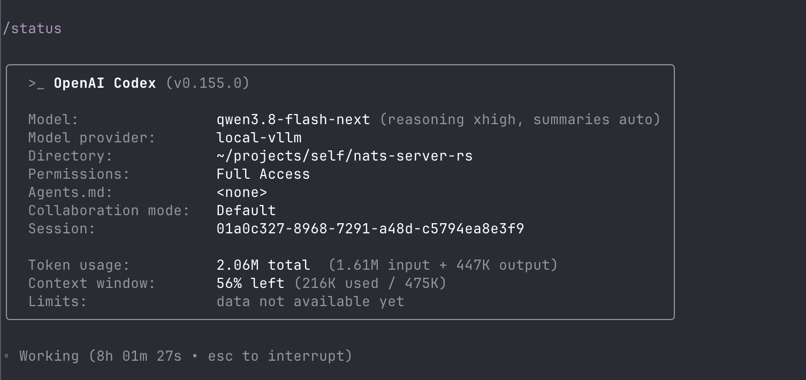

# What Can an Offline LLM Do on a Single DGX Spark? Rewriting NATS Core in Rust with NVIDIA Qwen3.8-Flash-Next-NVFP4

## Intro
When you use frontier LLMs that are served somewhere in a data center, you can't be sure that your work will stay private. Big companies claim that they are not using your chats and data, but can you be sure? Especially after this month's scandal involving OpenAI and private math research.
What if you need to be certain that your work won't leak? You don't have many options other than running models locally. Yes, they will be slower and not as smart as frontier models (of course, I'm talking about a consumer-grade setup).
I have an ASUS Ascent GX10 (similar to an NVIDIA DGX Spark) for local LLMs. I'm keen on running local LLMs on it and interested in what I can do with them.
I was curious: what substantial piece of work could I delegate to an AI agent and get done?
I've used [NATS](https://nats.io) at work for a long time.
I wondered: what if I asked an agent to rewrite the NATS server (only the core connectivity part) in Rust? There are many stories of development teams rewriting their projects in Rust and having them magically run faster. I knew that NATS was a carefully engineered project, and I didn't expect it to become faster in Rust. But I thought it would be an interesting exercise for AI, as well as easy to measure and test. Below, I'll describe the tools I used and the results of this experiment.

This was an experiment to explore what an offline model could do, not an attempt to create a production-ready or battle-tested replacement for the NATS server.

## Model
I wish I had a second Ascent—then I would have more options that can only run on a two-node cluster, such as nvidia/GLM-5.3-Flash-NVFP4 or nvidia/DeepSeek-V4.1-Flash-NVFP4. But today I'll describe my experience with one GB10 unit.
The model I used for this experiment was [nvidia/Qwen3.8-Flash-Next-NVFP4](https://huggingface.co/nvidia/Qwen3.8-Flash-Next-NVFP4): 125B parameters, with ~6B active MoE parameters plus a 51B-parameter n-gram. I can say that it is the smartest local model I've tried to date that can run on a single DGX box. Although it doesn't fit entirely in the memory of a single DGX Spark, even with NVFP4 quantization, it doesn't actually need to: a large portion of the model is a lookup table.
I used [this setup](https://github.com/blazux/qwen3.8-Flash-DGX.git). Its trick is to patch vLLM and offload this table via `mmap` to the Spark's NVMe storage. As a result, the OS keeps the hot items from this table—the ones we are actually using—in memory and offloads the others.
The unmodified model uses 75 GiB while being served. The remaining memory goes to the KV cache and `mmap`, and we can get a context window of up to 500k(!!!) with YaRN.
There are many different recipes for running this model on your DGX Spark; you can try others yourself. Some give you different trade-offs—for example, more tokens per second but lower quality. I wanted to run this exact model on a single Spark.


## Agent
A few months ago, I was using Claude Code as my main agent for local LLM execution. However, it wasn't working well: it struggled to distinguish between normal Claude Code usage and a local model; separate home directories weren't handled perfectly; and sometimes it asked me to log in again when it shouldn't have, complained about API keys, and so on. Its memory and CPU consumption didn't seem efficient. My main concern was that it is closed source. So I decided to look into alternatives. Moreover, I don't like tools written in non-compiled languages.
The first CLI tool that came to mind was OpenCode. It worked, but like Claude Code, it's written in TypeScript, and task execution was slow.
Next, I started looking for something explicitly implemented in a compiled language and found [jcode](https://jcode.sh). My first impression was good: open source, a low memory footprint and low CPU usage, and blazing-fast request/response parsing.
But I ended up dropping it: its model configuration wasn't mature, I had to put configuration in three different places, and even then it didn't fully update the model cache.
Then I remembered that Codex is open source and written in Rust (I hadn't used the OpenAI route much; I was more familiar with Claude Code).
And surprisingly, it worked very well. Blazing fast, with low CPU and memory usage—thanks, Rust. I can switch models and reasoning levels. And it can work and produce results over very long sessions.


<details>
<summary>Here are some configuration examples</summary>

```toml
model = "qwen3.8-flash-next"
model_provider = "local-vllm"
model_reasoning_effort = "xhigh"
model_catalog_json = "${HOME}/.codex-local/models.json"


[model_providers.local-vllm]
name = "DGX Spark vLLM"
base_url = "https://${your_self_hosted}/v1"
wire_api = "responses"
requires_openai_auth = false
env_key = "VLLM_API_KEY"

[otel]
metrics_exporter = "none"
trace_exporter = "none"
log_user_prompt = false
```

```json
{
  "models": [
    {
      "slug": "qwen3.8-flash-next",
      "display_name": "Qwen 3.8 Flash Next",
      "description": "Local Qwen 3.8 Flash Next via vLLM",
      "default_reasoning_level": "medium",
      "supported_reasoning_levels": [
        {
          "effort": "none",
          "description": "Fast — no reasoning"
        },
        {
          "effort": "medium",
          "description": "Medium reasoning"
        },
        {
          "effort": "xhigh",
          "description": "Maximum reasoning"
        }
      ],
      "shell_type": "unified_exec",
      "visibility": "list",
      "supported_in_api": true,
      "priority": 1,
      "base_instructions": "You are an agentic coding assistant. Work directly in the user's repository, use available tools when useful, and complete coding tasks accurately.",
      "supports_reasoning_summaries": true,
      "supports_reasoning_summary_parameter": true,
      "default_reasoning_summary": "none",
      "support_verbosity": false,
      "truncation_policy": {
        "mode": "tokens",
        "limit": 10000
      },
      "supports_parallel_tool_calls": true,
      "context_window": 500000,
      "experimental_supported_tools": []
    }
  ]
}
```
And a few files that override the levels, giving me different model/effort selectors in the TUI:
```bash
❯ cat ~/.codex-local/medium.config.toml
model_reasoning_effort = "medium"

cat ~/.codex-local/low.config.toml
model_reasoning_effort = "low"

cat ~/.codex-local/xhigh.config.toml
model_reasoning_effort = "xhigh"
```

> **Security warning:** The command below disables the Codex sandbox and all approval prompts, giving the agent unrestricted access to the machine. I used this configuration only on a headless Linux GX10—not on my personal laptop. Do not use these flags on a machine containing personal or valuable data.

```bash
# Custom key for Nginx authentication protecting the publicly exposed endpoint
# (to access the DGX Spark-hosted LLM away from home)
export VLLM_API_KEY='XXXX'
# Custom downloaded Codex binary
~/apps/codex  --sandbox danger-full-access  --ask-for-approval never
```

</details>

## Environment
I considered running it on my macOS laptop. But giving an AI agent full access (using the Codex flags `--sandbox danger-full-access --ask-for-approval never`) is scary. First, I tried creating a separate user with a different home directory and no access to my usual workflow and documents. It is a usable approach, but an agent with a local LLM can run for a very long time, so it wasn't very practical. I moved the actual experiment to the GX10 running as a headless Linux box; it did not run on my personal laptop. I ran everything on the GX10 itself because the LLM inference workload alternated with the workload of the commands the agent executed, and they mostly didn't overlap.

## Execution
Even though my setup can handle a 500k-token context window, the larger the window, the slower the responses. So the implementation of the NATS server in Rust had to be split into chunks.

The NATS server has various integration tests, and the idea was to use them as the source of truth. The plan was to implement similar tests in Rust and run them against the regular `nats-server` binary (written in Go).
To track execution better and resume progress after interruptions, I asked the agent to explore the source code and first prepare a plan with exact steps, and only then execute the actual work.

After approximately one hour, the tests ported from Go were ready and passing against the Go binary.

After that, I created a new session and asked the agent to prepare an implementation plan for core connectivity, without ACLs, JetStream, clustering, and so on. Then I gave it time to implement the plan. It worked for about eight hours and used 270k input tokens and 57k output tokens. (Don't try to calculate the eight-hour time per token directly—most of the time was spent running real tests. Only a small portion was spent waiting for tokens.)

Once the server was ready and the tests were passing, I ran the standard NATS benchmark against the upstream Go version and the new Rust version.

The Rust server worked, but it was twice as slow as the Go binary xD. I noticed that the Rust binary's numbers fluctuated during the benchmark, while the Go binary's remained stable. After some more investigation, I found that the Go NATS server did not allocate memory during the pub/sub of individual messages, unlike the Rust version.

So the next step was to optimize the Rust implementation of NATS. It turned out to be the longest and most token-consuming session. I explicitly asked the agent to beat the Go version of NATS in messages per second, referring to Go's GC.
The agent worked for another eight hours (as before, much of the time was spent on tests and benchmarks), used 1.6M input and 447k output tokens, and reached a 252k-token context window (nice numbers for a local model). It managed to beat the Go version in the single-client pub/sub throughput benchmark. It was the largest and most resource-intensive session.


Interestingly, at this stage, Go outperformed the Rust version with 10 connections. I could have asked the agent to optimize it again. But my goal was to see whether I could delegate a substantial piece of work to an offline, self-hosted agent, so I stopped here. I'm sure it would be possible to push further, bring in Anthropic or OpenAI models, and complete the reimplementation. But that wasn't the goal.
See the next section for the numbers.

### Benchmarks
Results on an Apple M1 Max:

Rust version, one connection:
```bash
nats bench sub  test
14:50:05 Starting Core NATS subscriber benchmark [clients=1, msg-size=128 B, msgs=100,000, multi-subject=false, subject=test]
14:50:05 [1] Starting Core NATS subscriber, expecting 100,000 messages
Finished      0s [=======================================================================================] 100%

NATS Core NATS subscriber stats: 2,900,614 msgs/sec ~ 354 MiB/sec
#----
nats bench pub  test
14:50:07 Starting Core NATS publisher benchmark [clients=1, msg-size=128 B, msgs=100,000, multi-subject=false, multi-subject-max=100,000, multi-subject-randomize=false, sleep=0s, subject=test]
14:50:07 [1] Starting Core NATS publisher, publishing 100,000 messages
Finished      0s [=======================================================================================] 100%

NATS Core NATS publisher stats: 3,224,372 msgs/sec ~ 394 MiB/sec ~ min: 0us ~ avg: 0.21us ~ max: 205.08us ~ P50: 0.08us ~ P90: 0.16us ~ P99: 0.5us ~ P99.9: 21.41us
```

Go version, one connection:
```bash
nats bench sub  test
14:48:11 Starting Core NATS subscriber benchmark [clients=1, msg-size=128 B, msgs=100,000, multi-subject=false, subject=test]
14:48:11 [1] Starting Core NATS subscriber, expecting 100,000 messages
Finished      0s [=======================================================================================] 100%
NATS Core NATS subscriber stats: 2,272,449 msgs/sec ~ 277 MiB/sec
#----
nats bench pub  test
14:48:14 Starting Core NATS publisher benchmark [clients=1, msg-size=128 B, msgs=100,000, multi-subject=false, multi-subject-max=100,000, multi-subject-randomize=false, sleep=0s, subject=test]
14:48:14 [1] Starting Core NATS publisher, publishing 100,000 messages
Finished      0s [=======================================================================================] 100%

NATS Core NATS publisher stats: 2,244,576 msgs/sec ~ 274 MiB/sec ~ min: 0us ~ avg: 0.30us ~ max: 1,029.5us ~ P50: 0.08us ~ P90: 0.16us ~ P99: 0.75us ~ P99.9: 19.83us
```

<details>
<summary>Rust version, 10 connections</summary>

```bash
nats bench pub --clients=10 test
14:58:20 Starting Core NATS publisher benchmark [clients=10, msg-size=128 B, msgs=100,000, multi-subject=false, multi-subject-max=100,000, multi-subject-randomize=false, sleep=0s, subject=test]
14:58:20 [1] Starting Core NATS publisher, publishing 10,000 messages
14:58:20 [2] Starting Core NATS publisher, publishing 10,000 messages
14:58:20 [3] Starting Core NATS publisher, publishing 10,000 messages
14:58:20 [4] Starting Core NATS publisher, publishing 10,000 messages
14:58:20 [5] Starting Core NATS publisher, publishing 10,000 messages
14:58:20 [6] Starting Core NATS publisher, publishing 10,000 messages
14:58:20 [7] Starting Core NATS publisher, publishing 10,000 messages
14:58:20 [8] Starting Core NATS publisher, publishing 10,000 messages
14:58:20 [9] Starting Core NATS publisher, publishing 10,000 messages
14:58:20 [10] Starting Core NATS publisher, publishing 10,000 messages
Finished      0s [=======================================================================================] 100%
Finished      0s [=======================================================================================] 100%
Finished      0s [=======================================================================================] 100%
Finished      0s [=======================================================================================] 100%
Finished      0s [=======================================================================================] 100%
Finished      0s [=======================================================================================] 100%
Finished      0s [=======================================================================================] 100%
Finished      0s [=======================================================================================] 100%
Finished      0s [=======================================================================================] 100%
Finished      0s [=======================================================================================] 100%

  [1] 27,640 msgs/sec ~ 3.4 MiB/sec ~ min: 0.04us ~ avg: 0.73us ~ max: 1,872.29us ~ P50: 0.12us ~ P90: 0.16us ~ P99: 0.33us ~ P99.9: 107.16us (10,000 msgs)
  [2] 27,638 msgs/sec ~ 3.4 MiB/sec ~ min: 0.04us ~ avg: 0.77us ~ max: 1,293.16us ~ P50: 0.08us ~ P90: 0.16us ~ P99: 0.29us ~ P99.9: 220.58us (10,000 msgs)
  [3] 27,516 msgs/sec ~ 3.4 MiB/sec ~ min: 0.04us ~ avg: 0.68us ~ max: 1,909.58us ~ P50: 0.08us ~ P90: 0.12us ~ P99: 0.20us ~ P99.9: 85.62us (10,000 msgs)
  [4] 27,448 msgs/sec ~ 3.4 MiB/sec ~ min: 0us ~ avg: 0.81us ~ max: 2,461.41us ~ P50: 0.12us ~ P90: 0.16us ~ P99: 0.25us ~ P99.9: 53us (10,000 msgs)
  [5] 26,982 msgs/sec ~ 3.3 MiB/sec ~ min: 0.04us ~ avg: 0.67us ~ max: 2,242.33us ~ P50: 0.08us ~ P90: 0.12us ~ P99: 0.29us ~ P99.9: 80.62us (10,000 msgs)
  [6] 26,965 msgs/sec ~ 3.3 MiB/sec ~ min: 0.04us ~ avg: 0.52us ~ max: 2,015.62us ~ P50: 0.12us ~ P90: 0.12us ~ P99: 0.29us ~ P99.9: 19.75us (10,000 msgs)
  [7] 26,805 msgs/sec ~ 3.3 MiB/sec ~ min: 0.04us ~ avg: 0.78us ~ max: 1,726.29us ~ P50: 0.08us ~ P90: 0.12us ~ P99: 0.37us ~ P99.9: 61.54us (10,000 msgs)
  [8] 26,683 msgs/sec ~ 3.3 MiB/sec ~ min: 0.04us ~ avg: 0.86us ~ max: 1,583.83us ~ P50: 0.12us ~ P90: 0.16us ~ P99: 0.25us ~ P99.9: 176.70us (10,000 msgs)
  [9] 26,704 msgs/sec ~ 3.3 MiB/sec ~ min: 0.04us ~ avg: 0.81us ~ max: 2,462.91us ~ P50: 0.08us ~ P90: 0.16us ~ P99: 0.29us ~ P99.9: 56.16us (10,000 msgs)
  [10] 26,684 msgs/sec ~ 3.3 MiB/sec ~ min: 0us ~ avg: 0.71us ~ max: 1,912us ~ P50: 0.12us ~ P90: 0.12us ~ P99: 0.33us ~ P99.9: 94.45us (10,000 msgs)

 NATS Core NATS publisher aggregated stats: 266,783 msgs/sec ~ 33 MiB/sec
 message rates min 26,683 | avg 27,106 | max 27,640 | stddev 387 msgs
 latencies per operation min 0us | avg 0.73us | max 2,462.91us | stddev 26.03us | P50 0.12us | P90 0.16us | P99 0.29us | P99.9: 85.62us

 #---

 nats bench sub --clients=10 test
14:58:16 Starting Core NATS subscriber benchmark [clients=10, msg-size=128 B, msgs=100,000, multi-subject=false, subject=test]
14:58:16 [3] Starting Core NATS subscriber, expecting 100,000 messages
14:58:16 [2] Starting Core NATS subscriber, expecting 100,000 messages
14:58:16 [1] Starting Core NATS subscriber, expecting 100,000 messages
14:58:16 [4] Starting Core NATS subscriber, expecting 100,000 messages
14:58:16 [5] Starting Core NATS subscriber, expecting 100,000 messages
14:58:16 [6] Starting Core NATS subscriber, expecting 100,000 messages
14:58:16 [7] Starting Core NATS subscriber, expecting 100,000 messages
14:58:16 [8] Starting Core NATS subscriber, expecting 100,000 messages
14:58:16 [9] Starting Core NATS subscriber, expecting 100,000 messages
14:58:16 [10] Starting Core NATS subscriber, expecting 100,000 messages
Finished      0s [=======================================================================================] 100%
Finished      0s [=======================================================================================] 100%
Finished      0s [=======================================================================================] 100%
Finished      0s [=======================================================================================] 100%
Finished      0s [=======================================================================================] 100%
Finished      0s [=======================================================================================] 100%
Finished      0s [=======================================================================================] 100%
Finished      0s [=======================================================================================] 100%
Finished      0s [=======================================================================================] 100%
Finished      0s [=======================================================================================] 100%

  [1] 237,279 msgs/sec ~ 29 MiB/sec (100,000 msgs)
  [2] 235,163 msgs/sec ~ 29 MiB/sec (100,000 msgs)
  [3] 230,677 msgs/sec ~ 28 MiB/sec (100,000 msgs)
  [4] 227,141 msgs/sec ~ 28 MiB/sec (100,000 msgs)
  [5] 226,587 msgs/sec ~ 28 MiB/sec (100,000 msgs)
  [6] 226,278 msgs/sec ~ 28 MiB/sec (100,000 msgs)
  [7] 223,941 msgs/sec ~ 27 MiB/sec (100,000 msgs)
  [8] 221,845 msgs/sec ~ 27 MiB/sec (100,000 msgs)
  [9] 221,645 msgs/sec ~ 27 MiB/sec (100,000 msgs)
  [10] 220,203 msgs/sec ~ 27 MiB/sec (100,000 msgs)

 NATS Core NATS subscriber aggregated stats: 2,201,201 msgs/sec ~ 269 MiB/sec
 message rates min 220,203 | avg 227,075 | max 237,279 | stddev 5,452 msgs 

```
</details>


<details>
<summary>Go version, 10 connections</summary>

```bash
nats bench pub --clients=10 test
15:00:11 Starting Core NATS publisher benchmark [clients=10, msg-size=128 B, msgs=100,000, multi-subject=false, multi-subject-max=100,000, multi-subject-randomize=false, sleep=0s, subject=test]
15:00:11 [1] Starting Core NATS publisher, publishing 10,000 messages
15:00:11 [2] Starting Core NATS publisher, publishing 10,000 messages
15:00:11 [3] Starting Core NATS publisher, publishing 10,000 messages
15:00:11 [4] Starting Core NATS publisher, publishing 10,000 messages
15:00:11 [5] Starting Core NATS publisher, publishing 10,000 messages
15:00:11 [6] Starting Core NATS publisher, publishing 10,000 messages
15:00:11 [7] Starting Core NATS publisher, publishing 10,000 messages
15:00:11 [8] Starting Core NATS publisher, publishing 10,000 messages
15:00:11 [9] Starting Core NATS publisher, publishing 10,000 messages
15:00:11 [10] Starting Core NATS publisher, publishing 10,000 messages
Finished      0s [=======================================================================================] 100%
Finished      0s [=======================================================================================] 100%
Finished      0s [=======================================================================================] 100%
Finished      0s [=======================================================================================] 100%
Finished      0s [=======================================================================================] 100%
Finished      0s [=======================================================================================] 100%
Finished      0s [=======================================================================================] 100%
Finished      0s [=======================================================================================] 100%
Finished      0s [=======================================================================================] 100%
Finished      0s [=======================================================================================] 100%

  [1] 37,701 msgs/sec ~ 4.6 MiB/sec ~ min: 0.04us ~ avg: 1.06us ~ max: 5,431.25us ~ P50: 0.08us ~ P90: 0.16us ~ P99: 0.37us ~ P99.9: 41.04us (10,000 msgs)
  [2] 35,322 msgs/sec ~ 4.3 MiB/sec ~ min: 0us ~ avg: 0.88us ~ max: 3,624.62us ~ P50: 0.08us ~ P90: 0.12us ~ P99: 0.20us ~ P99.9: 17.37us (10,000 msgs)
  [3] 34,930 msgs/sec ~ 4.3 MiB/sec ~ min: 0us ~ avg: 1.31us ~ max: 5,388.5us ~ P50: 0.08us ~ P90: 0.12us ~ P99: 0.25us ~ P99.9: 32.62us (10,000 msgs)
  [4] 34,458 msgs/sec ~ 4.2 MiB/sec ~ min: 0.04us ~ avg: 1.11us ~ max: 4,041.20us ~ P50: 0.08us ~ P90: 0.12us ~ P99: 0.20us ~ P99.9: 23.45us (10,000 msgs)
  [5] 34,055 msgs/sec ~ 4.2 MiB/sec ~ min: 0.04us ~ avg: 0.95us ~ max: 3,057.08us ~ P50: 0.08us ~ P90: 0.12us ~ P99: 0.20us ~ P99.9: 20.95us (10,000 msgs)
  [6] 33,978 msgs/sec ~ 4.1 MiB/sec ~ min: 0.04us ~ avg: 1.24us ~ max: 4,416.45us ~ P50: 0.08us ~ P90: 0.12us ~ P99: 0.25us ~ P99.9: 16.25us (10,000 msgs)
  [7] 33,288 msgs/sec ~ 4.1 MiB/sec ~ min: 0us ~ avg: 1.11us ~ max: 2,498us ~ P50: 0.08us ~ P90: 0.12us ~ P99: 0.20us ~ P99.9: 197.41us (10,000 msgs)
  [8] 33,155 msgs/sec ~ 4.0 MiB/sec ~ min: 0us ~ avg: 1.01us ~ max: 3,041.37us ~ P50: 0.08us ~ P90: 0.16us ~ P99: 0.29us ~ P99.9: 175.79us (10,000 msgs)
  [9] 33,009 msgs/sec ~ 4.0 MiB/sec ~ min: 0.04us ~ avg: 0.63us ~ max: 1,722.29us ~ P50: 0.08us ~ P90: 0.16us ~ P99: 0.33us ~ P99.9: 42.12us (10,000 msgs)
  [10] 32,874 msgs/sec ~ 4.0 MiB/sec ~ min: 0.04us ~ avg: 1.20us ~ max: 4,697us ~ P50: 0.08us ~ P90: 0.12us ~ P99: 0.20us ~ P99.9: 51.37us (10,000 msgs)

 NATS Core NATS publisher aggregated stats: 328,738 msgs/sec ~ 40 MiB/sec
 message rates min 32,874 | avg 34,277 | max 37,701 | stddev 1,386 msgs
 latencies per operation min 0us | avg 1.05us | max 5,431.25us | stddev 47.33us | P50 0.08us | P90 0.12us | P99 0.25us | P99.9: 34.62us

#---
 nats bench sub --clients=10 test
15:00:08 Starting Core NATS subscriber benchmark [clients=10, msg-size=128 B, msgs=100,000, multi-subject=false, subject=test]
15:00:08 [1] Starting Core NATS subscriber, expecting 100,000 messages
15:00:08 [2] Starting Core NATS subscriber, expecting 100,000 messages
15:00:08 [3] Starting Core NATS subscriber, expecting 100,000 messages
15:00:08 [4] Starting Core NATS subscriber, expecting 100,000 messages
15:00:08 [5] Starting Core NATS subscriber, expecting 100,000 messages
15:00:08 [6] Starting Core NATS subscriber, expecting 100,000 messages
15:00:08 [7] Starting Core NATS subscriber, expecting 100,000 messages
15:00:08 [8] Starting Core NATS subscriber, expecting 100,000 messages
15:00:08 [9] Starting Core NATS subscriber, expecting 100,000 messages
15:00:08 [10] Starting Core NATS subscriber, expecting 100,000 messages
Finished      0s [=======================================================================================] 100%
Finished      0s [=======================================================================================] 100%
Finished      0s [=======================================================================================] 100%
Finished      0s [=======================================================================================] 100%
Finished      0s [=======================================================================================] 100%
Finished      0s [=======================================================================================] 100%
Finished      0s [=======================================================================================] 100%
Finished      0s [=======================================================================================] 100%
Finished      0s [=======================================================================================] 100%
Finished      0s [=======================================================================================] 100%

  [1] 329,612 msgs/sec ~ 40 MiB/sec (100,000 msgs)
  [2] 329,642 msgs/sec ~ 40 MiB/sec (100,000 msgs)
  [3] 329,619 msgs/sec ~ 40 MiB/sec (100,000 msgs)
  [4] 329,606 msgs/sec ~ 40 MiB/sec (100,000 msgs)
  [5] 329,600 msgs/sec ~ 40 MiB/sec (100,000 msgs)
  [6] 329,683 msgs/sec ~ 40 MiB/sec (100,000 msgs)
  [7] 329,566 msgs/sec ~ 40 MiB/sec (100,000 msgs)
  [8] 329,513 msgs/sec ~ 40 MiB/sec (100,000 msgs)
  [9] 329,529 msgs/sec ~ 40 MiB/sec (100,000 msgs)
  [10] 329,882 msgs/sec ~ 40 MiB/sec (100,000 msgs)

 NATS Core NATS subscriber aggregated stats: 3,295,012 msgs/sec ~ 402 MiB/sec
 message rates min 329,513 | avg 329,625 | max 329,882 | stddev 98 msgs
```
</details>


#### Summary

Throughput, rounded from the benchmark logs above:

| Clients | Operation | Rust | Go | Rust vs. Go |
|---:|---|---:|---:|---:|
| 1 | Subscribe | 2.90M msg/s | 2.27M msg/s | +27.6% |
| 1 | Publish | 3.22M msg/s | 2.24M msg/s | +43.7% |
| 10 | Subscribe | 2.20M msg/s | 3.30M msg/s | −33.2% |
| 10 | Publish | 266.8k msg/s | 328.7k msg/s | −18.8% |

## Conclusions
1. Today, you can complete quite complex work fully offline in very long-running sessions on consumer hardware such as a DGX Spark. Yes, it is slower than frontier models, but it can do real work and get things done.
2. The NATS server is very well written. I've used it for a long time, and this experiment convinced me once again. A carefully organized Go application can be as efficient as software written in a language without a garbage collector while retaining Go's low maintenance cost. Rewriting everything in Rust will not magically speed up your service.

You can look through the generated Rust server code on GitHub: [nats-server-rs](https://github.com/antlad/nats-server-rs.git).
